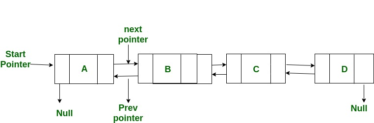

# Linked Lists

Stacks are a powerful tool, but as previously discussed, we can't change any elements that are not at the end of the array. Doing so would result in a O(n) operation. The linked list is the solution to this problem.

## What is a Linked List?

---

A Linked List is a unique type of data structure that allows us to add and remove elements from array without having to shift elements in a O(n) operation.

## How it works

---

In a linked list, you do not have to have elements stored in contiguous memory. Instead, all we need to do is have each element point to the previous and next element in the array. A linked list starts out with a head and ends with a tail. We always have access to these two elements. To find an element in an array, we can search forward from the head or backwards from the tail n amount of times until we reach the desired element.

## Why use it?

---

Since linked lists are basically a collection of pointers, adding and removing elements in a linked list is a very efficient operation.

## Limitations

---

Linked lists are not contiguous in memory, and thus we do not have the O(1) look-up time we have in a normal array. We must actually traverse the list until we find the element, which can be expensive.

## Time Complexity

---

If we are accessing a linked list at the head or tail, we have an immiediete O(1) lookup. If we have a element in the middle, it will take O(n) time to reach the element.
However, modifying an element after it is found is only an O(1) operation.

### Examples

    Coming Soon...
