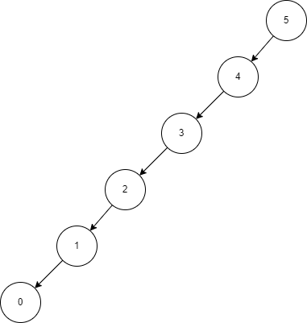

# Binary Trees

If you have ever done family history, you're familiar with the concept of a family tree. The tree allows you to quickly navigate through your ancestors. It is a wonderful tool
for furthering the lords work, but oddly enough, is also a wonderful tool when used in programming as well!

## What is a Binary Tree?

---

A binary tree is a data structure that places data on either the right or left side of a particular root element. If the value being inserted is less than the root value, it goes to the left. If the value is greater than the root, it falls on the right. Assuming the root's value is roughly the average of all values in the structure, this will result in a balanced binary tree.

## How it works

---

To understand how binary trees work, we need to understand a new concept called recursion.

-   ### Recursion
    ***
    Recursion is the programming principle of iterating a function on an increasingly smaller data set. Within our recursive function, after doing whatever we need to the dataset, we call the same function on a subset of that same dataset. This pattern continues until we get to something called a base case. This base case is what ends our recursive function, and begins returning statements back up the call chain.

One very practical use of recursion is within searching for an element within a binary tree. When given an element to find, we can start at the root and make a comparison. If the element is less than the root, we can move to the left. The opposite is true for the right side. We can then repeat that process on the sub tree we have moved to. This is the nature of a recursive action. We can repeat until we reach the base cases; the element is found or we have reached the end of the tree and the element is not in the structure.

## Limitations

---

Binary trees can be considered hard to work with, and the data you received will not always be balanced. This can cause your tree be skewed, and thus result in bad performance. Imagine you receive a data set starting at 5, ending at 0, and increments by 1 This means you would have a tree that falls all on one side.

## Time Complexity

---

If we are accessing a linked list at the head or tail, we have an immiediete O(1) lookup. If we have a element in the middle, it will take O(n) time to reach the element.
However, modifying an element after it is found is only an O(1) operation.

### Examples

    Coming Soon...
