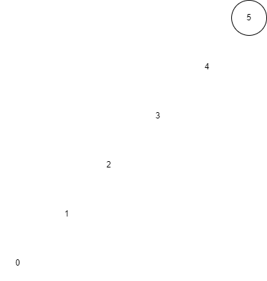

# Binary Trees

If you have ever done family history, you're familiar with the concept of a family tree. The tree allows you to quickly navigate through your ancestors. It is a wonderful tool
for furthering the lords work, but oddly enough, is also a wonderful tool when used in programming as well!

## What is a Binary Tree?

---

A binary tree is a data structure that places data on either the right or left side of a particular root element. If the value being inserted is less than the root value, it goes to the left. If the value is greater than the root, it falls on the right. Assuming the root's value is roughly the average of all values in the structure, this will result in a balanced binary tree.


## How it works

---

To understand how binary trees work, we need to understand a new concept called recursion.

-   ### Recursion
    ***
    Recursion is the programming principle of iterating a function on an increasingly smaller data set. Within our recursive function, after doing whatever we need to the dataset, we call the same function on a subset of that same dataset. This pattern continues until we get to something called a base case. This base case is what ends our recursive function, and begins returning statements back up the call chain.

One very practical use of recursion is within searching for an element within a binary tree. When given an element to find, we can start at the root and make a comparison. If the element is less than the root, we can move to the left. The opposite is true for the right side. We can then repeat that process on the sub tree we have moved to. This is the nature of a recursive action. We can repeat until we reach the base cases; the element is found or we have reached the end of the tree and the element is not in the structure.

## Limitations

---

Binary trees can be considered hard to work with, and the data you received will not always be balanced. This can cause your tree be skewed, and thus result in bad performance. Imagine you receive a data set starting at 5, ending at 0, and increments by 1. This means you would have a tree that falls all on one side.


In the worst case scenario, finding an element in a tree like this would O(n) time, which is completely unacceptable. To counteract this, we must actively balance the tree as we receive new information, which is added complexity.

## Time Complexity

---

Since we use recursion to find elements in a binary tree, we are constantly focusing on smaller subsets of the tree. This means that each time we call our searching function, we don't need to worry about the other half of our array. This is O(log n) behavior. Since we need to find an element every time we remove or add an element, those operations are also O(log n) in time complexity.

### Example

An implementation of a binary tree in python.

```python
# A compeleted implementation of a binary tree.
class BST:
    """
    Implement the Binary Search Tree (BST) data structure.  The Node
    class below is an inner class.  An inner class means that its real
    name is related to the outer class.  To create a Node object, we will
    need to specify BST.Node
    """

    class Node:
        """
        Each node of the BST will have data and links to the
        left and right sub-tree.
        """

        def __init__(self, data):
            """
            Initialize the node to the data provided.  Initially
            the links are unknown so they are set to None.
            """

            self.data = data
            self.left = None
            self.right = None

    def __init__(self):
        """
        Initialize an empty BST.
        """
        self.root = None

    def insert(self, data):
        """
        Insert 'data' into the BST.  If the BST
        is empty, then set the root equal to the new
        node.  Otherwise, use _insert to recursively
        find the location to insert.
        """
        if self.root == None:
          self.root = BST.Node(data)
        else:
          self._insert(data, self.root) #Starting at the root node

    def _insert(self, data, node):
        """
        This function will look for a place to insert a node
        with 'data' inside of it.  The current sub-tree is
        represented by 'node'.  This function is intended to be
        called the first time by the insert function.
        """
        if data < node.data:
          if node.left is None:
            node.left = BST.Node(data)
          else:
            self._insert(data, node.left)
        else:
          if node.right is None:
            node.right = BST.Node(data)
          else:
            self._insert(data, node.right)

    def __iter__(self):
        """
        Perform a forward traversal (in order traversal) starting from
        the root of the BST.
        """
        yield from self._traverse_forward(self.root)


    def _traverse_forward(self, node):
        """
        Does a forward traversal (in-order traversal) through the
        BST.  If the node that we are given (which is the current
        sub-tree) exists, then we will keep traversing on the left
        side (thus getting the smaller numbers first), then we will
        provide the data in the current node, and finally we will
        traverse on the right side (thus getting the larger numbers last).

        This function is intended to be called the first time by
        the __iter__ function.
        """
        if node is not None:
          yield from self._traverse_forward(node.left)
          yield node.data
          yield from self._traverse_forward(node.right)

tree = BST()
tree.insert(5)
tree.insert(3)
tree.insert(7)
tree.insert(10)
tree.insert(1)
```

### Try it yourself!

[Binary Tree Deletion Problem](py_files/binaryTree_2.py)
